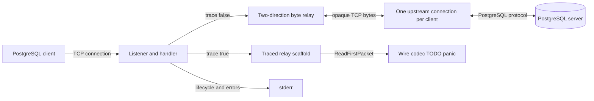
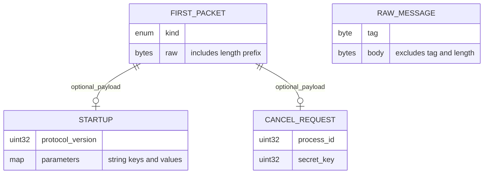
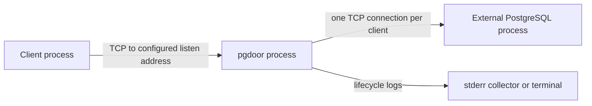

# Architecture

## Overview

The implemented system is a single executable forwarding opaque TCP bytes. Each accepted client gets its own handler and fresh upstream connection; there is no connection reuse or multiplexing ([main.go:58](../../cmd/pgdoor/main.go#L58), [main.go:92](../../cmd/pgdoor/main.go#L92)). A second relay path has been wired to the protocol API, but its first parser call is a panic stub. The much larger architecture in [PLAN.md:219](../../PLAN.md#L219) describes future work, not the current runtime.

## Components

| Component | Responsibility | Lives in | Talks to |
| --- | --- | --- | --- |
| Executable and session handler | Parse flags, listen/accept, dial upstream, select relay, wait for shutdown | [cmd/pgdoor](../../cmd/pgdoor), [main.go:29](../../cmd/pgdoor/main.go#L29) | `net`, signals, proxy, stderr logger |
| Raw relay | Copy in both directions, propagate EOF with half-close, remember first meaningful error | [internal/proxy](../../internal/proxy), [relay.go:34](../../internal/proxy/relay.go#L34) | Two `net.Conn` objects |
| Traced relay scaffold | Intended startup classification and per-message logging/forwarding; currently blocked at first parser call | [internal/proxy](../../internal/proxy), [relay.go:77](../../internal/proxy/relay.go#L77) | `pgwire`, logger, raw relay fallback |
| Wire codec scaffold | Protocol types, tag constants, buffer constructors; parsing/encoding/description bodies unimplemented | [internal/pgwire](../../internal/pgwire), [message.go:73](../../internal/pgwire/message.go#L73), [startup.go:94](../../internal/pgwire/startup.go#L94) | Intended trace reader/writer, codec tests |

See the [file map](03-structure.md) for each component's functions and implementation status. No auth, pool, cancellation registry, prepared-statement cache, or admin package exists in the tracked tree; those names come from the [proposed layout](../../PLAN.md#L253).

## Boundaries and contracts

- **Process configuration:** listener address, upstream address, trace flag, and upstream dial timeout are captured at startup. No hot reload exists ([main.go:30](../../cmd/pgdoor/main.go#L30)).
- **Handler to relay:** the handler owns both connections and defers their full close. It enables TCP no-delay where available, dials once, and then calls one relay ([main.go:79](../../cmd/pgdoor/main.go#L79)).
- **Relay to peers:** raw mode does not parse PostgreSQL, terminate authentication, inspect transaction status, or create protocol errors; it copies bytes and signals write-side EOF. It waits for both copy goroutines ([relay.go:51](../../internal/proxy/relay.go#L51)).
- **I/O failures:** `nil`, `io.EOF`, and `net.ErrClosed` are ignored by the relay's error recorder; the first other error is retained under a mutex. Half-close/full-close fallback errors are ignored ([relay.go:40](../../internal/proxy/relay.go#L40)).
- **Future codec contract:** framed messages have a one-byte tag plus a big-endian length that includes its four-byte field and excludes the tag; startup is untagged. The 16 MiB body limit and malformed-input handling are specified but not implemented ([message.go:8](../../internal/pgwire/message.go#L8), [message.go:124](../../internal/pgwire/message.go#L124), [startup.go:86](../../internal/pgwire/startup.go#L86)). Raw mode does not enforce that limit.

## Data model

There is no local persistent data model. The working relay holds sockets and synchronization state. The types below are protocol scaffolding in memory, not records stored by pgdoor.

| Entity | Lifetime/storage | Key fields or state | Defined at |
| --- | --- | --- | --- |
| Client/upstream pair | One active handler | Two connections and upstream dial timeout | [main.go:79](../../cmd/pgdoor/main.go#L79) |
| Raw relay state | Until both directions finish | WaitGroup, mutex, first error | [relay.go:35](../../internal/proxy/relay.go#L35) |
| `RawMessage` | Intended decoded message | Tag and uninterpreted body | [message.go:73](../../internal/pgwire/message.go#L73) |
| `Reader` / `Writer` | Wrapper lifetime | 32 KiB `bufio` readers/writers | [message.go:115](../../internal/pgwire/message.go#L115), [message.go:146](../../internal/pgwire/message.go#L146) |
| `Startup` | Intended initial packet | Protocol version and parameter map | [startup.go:17](../../internal/pgwire/startup.go#L17) |
| `CancelRequest` | Intended cancellation packet | Process ID and cancellation secret key | [startup.go:54](../../internal/pgwire/startup.go#L54) |
| `FirstPacket` | Intended classified first packet | Kind, optional Startup/Cancel pointer, exact raw bytes | [startup.go:75](../../internal/pgwire/startup.go#L75) |

`KindStartup` should select the startup payload and `KindCancelRequest` the cancellation payload; SSL/GSS request kinds require neither. The comment saying exactly one payload is non-nil is therefore incomplete for the encryption-request variants ([startup.go:62](../../internal/pgwire/startup.go#L62), [startup.go:73](../../internal/pgwire/startup.go#L73)). No parser currently establishes any of these invariants.

## State and persistence

pgdoor writes logs to stderr and keeps connection state only in memory. Database rows, transactions, authentication, prepared statements, and session settings remain on the upstream connection in raw mode because every byte is passed through ([main.go:38](../../cmd/pgdoor/main.go#L38), [relay.go:53](../../internal/proxy/relay.go#L53)). A restart loses those connections; the executable has no session handover, replay, or state store. A transaction-status constant such as `TxIdle` is vocabulary for later pooling, not a release policy in the current relay ([tags.go:74](../../internal/pgwire/tags.go#L74)).

## Deployment

The default development topology listens at `:6432` and forwards to `localhost:5432`, but both are flags ([main.go:31](../../cmd/pgdoor/main.go#L31)). `make build` produces one binary; no container, orchestration, database provisioning, or CI manifest is tracked ([Makefile:3](../../Makefile#L3), [structure inventory](03-structure.md)). Raw mode can forward protocol-negotiated encrypted bytes without inspecting them; pgdoor itself has no implemented TLS endpoint or independent auth handshake ([relay.go:34](../../internal/proxy/relay.go#L34), [PLAN.md:302](../../PLAN.md#L302), [PLAN.md:336](../../PLAN.md#L336)).

## Failure and scale

- **Listen failure:** log fatal and exit. **Accept failure:** break on `net.ErrClosed`; otherwise log and immediately retry, with no backoff ([main.go:40](../../cmd/pgdoor/main.go#L40), [main.go:58](../../cmd/pgdoor/main.go#L58)).
- **Upstream dial failure:** log and close the client through its defer; there is no retry or PostgreSQL-formatted error response ([main.go:92](../../cmd/pgdoor/main.go#L92)).
- **Mid-session failure/EOF:** one copy direction half-closes its destination, but the relay still waits for the other direction. No session read/write deadlines or coordinated cancellation are installed ([relay.go:51](../../internal/proxy/relay.go#L51), [main.go:102](../../cmd/pgdoor/main.go#L102)).
- **Signal:** SIGINT/SIGTERM closes the listener, then waits for all handlers. A peer that stays connected can prevent shutdown indefinitely ([main.go:46](../../cmd/pgdoor/main.go#L46), [main.go:73](../../cmd/pgdoor/main.go#L73)).
- **Trace enabled:** after upstream connection succeeds, a codec panic is unrecovered and can terminate the whole process, not just that session ([main.go:67](../../cmd/pgdoor/main.go#L67), [startup.go:94](../../internal/pgwire/startup.go#L94)).
- **Scaling, inferred from the code:** each established raw session consumes two sockets, one handler goroutine waiting for two copy goroutines, and one upstream backend connection. There is no client cap, wait queue, shared pool, or load-balancing policy; this version adds a hop without reducing PostgreSQL connections ([main.go:66](../../cmd/pgdoor/main.go#L66), [main.go:92](../../cmd/pgdoor/main.go#L92), [relay.go:63](../../internal/proxy/relay.go#L63)). No performance results are recorded ([docs/benchmarks.md:21](../benchmarks.md#L21)).
