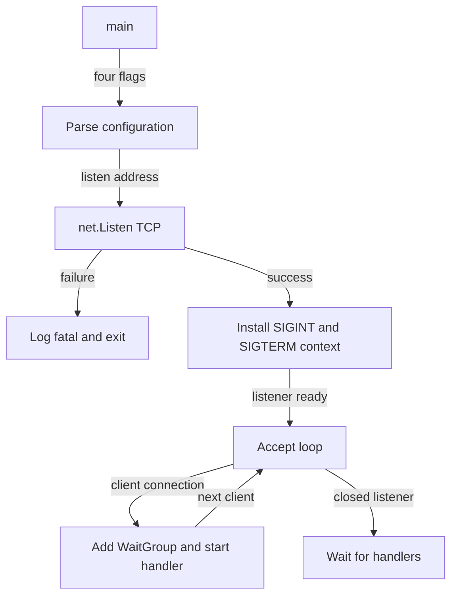
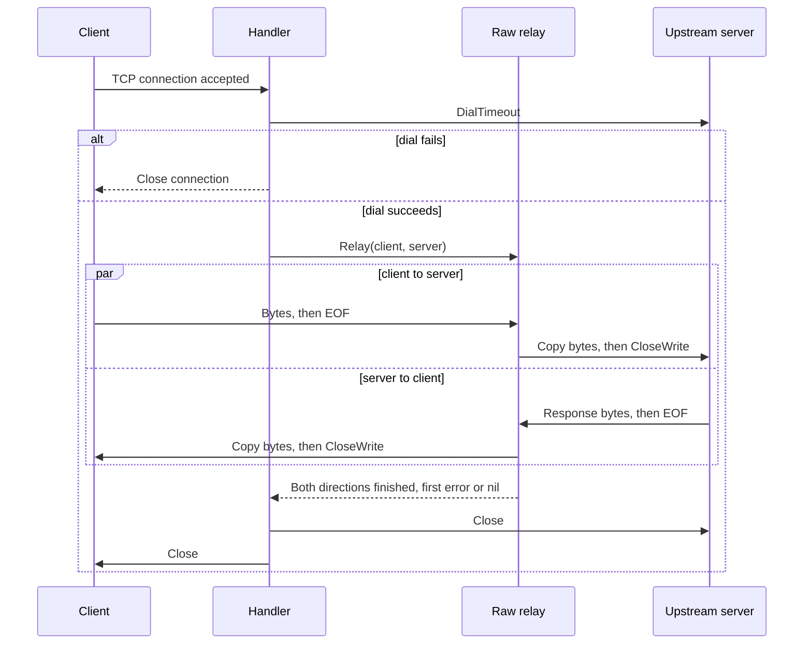
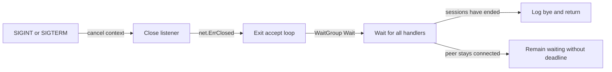
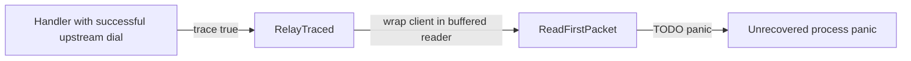
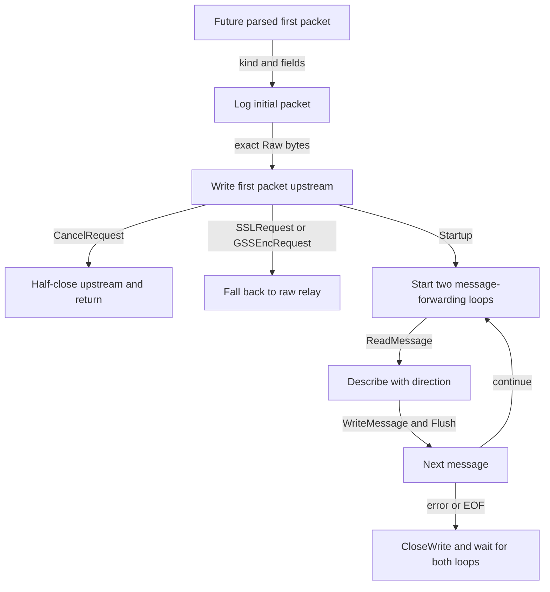
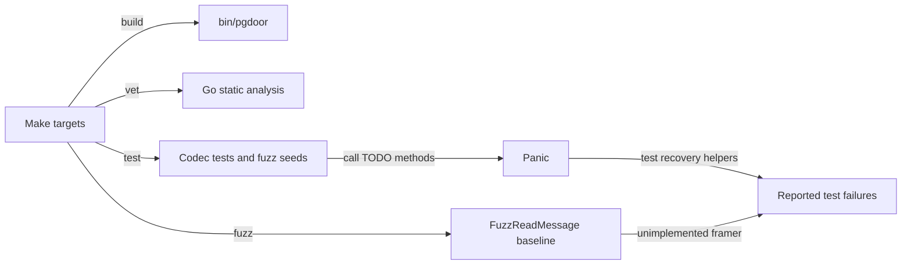

# Flow

## Startup

1. **Parse flags and initialize logging:** capture listener/upstream, `-trace`, and `-dial-timeout`; create the stderr logger with date/time and microseconds. [main.go:29](../../cmd/pgdoor/main.go#L29) · [structure](03-structure.md#command).
2. **Bind:** call `net.Listen`; fatal log exits on failure, otherwise report the bound address and configuration. Listening precedes any upstream connection attempt. [main.go:40](../../cmd/pgdoor/main.go#L40) · [structure](03-structure.md#command).
3. **Install signal handling:** a context receives SIGINT/SIGTERM; a goroutine closes the listener when canceled, unblocking `Accept`. [main.go:46](../../cmd/pgdoor/main.go#L46) · [structure](03-structure.md#command).
4. **Accept and dispatch:** for each accepted client, increment the session WaitGroup and start a handler with deferred `Done`. Other accept errors are logged/retried; `net.ErrClosed` ends the loop. [main.go:56](../../cmd/pgdoor/main.go#L56) · [structure](03-structure.md#command).

## Session lifecycle

1. **Own the client:** defer full close, log connection/disconnection, and request TCP no-delay when the concrete connection is `*net.TCPConn`. [main.go:79](../../cmd/pgdoor/main.go#L79) · [structure](03-structure.md#command).
2. **Create the upstream connection:** dial the configured TCP endpoint with the configured timeout. A dial error returns after logging, closing the client. On success defer server close and request no-delay there too. [main.go:92](../../cmd/pgdoor/main.go#L92) · [structure](03-structure.md#command).
3. **Select raw mode:** with `-trace=false`, call `proxy.Relay`. It initializes a WaitGroup, error mutex, and first-error slot. [main.go:102](../../cmd/pgdoor/main.go#L102), [relay.go:34](../../internal/proxy/relay.go#L34) · [command structure](03-structure.md#command), [proxy structure](03-structure.md#proxy).
4. **Forward both byte streams:** launch `io.Copy(server, client)` and `io.Copy(client, server)` concurrently. pgdoor parses no startup, auth, query, result, or transaction boundary on this path. Response bytes simply traverse the reverse copy. [relay.go:51](../../internal/proxy/relay.go#L51), [relay.go:63](../../internal/proxy/relay.go#L63) · [structure](03-structure.md#proxy).
5. **Propagate EOF without immediately destroying the reverse stream:** when one copy completes, record any meaningful error and call `CloseWrite` on that direction's destination; a connection without that capability is fully closed instead. This does not generate a PostgreSQL `Terminate` message. [relay.go:40](../../internal/proxy/relay.go#L40), [relay.go:55](../../internal/proxy/relay.go#L55) · [structure](03-structure.md#proxy).
6. **Finish the session:** wait for both directions, return the first nonignored error, log any session error in the handler, then run its close/disconnection defers and complete the outer WaitGroup. [relay.go:66](../../internal/proxy/relay.go#L66), [main.go:108](../../cmd/pgdoor/main.go#L108), [main.go:67](../../cmd/pgdoor/main.go#L67) · [proxy structure](03-structure.md#proxy), [command structure](03-structure.md#command).

The dial timeout covers connection establishment only. A finished copy does not guarantee the other copy will finish; both the relay and process can remain waiting on a peer.

## Shutdown

1. **Stop accepting:** context cancellation closes the listener, ending the accept loop on `net.ErrClosed`. [main.go:46](../../cmd/pgdoor/main.go#L46), [main.go:58](../../cmd/pgdoor/main.go#L58) · [structure](03-structure.md#command).
2. **Wait for disconnects:** `wg.Wait` has no deadline and does not close existing connections or cancel active dials. Only after all handlers finish does `main` log `bye` and return. The source comment explicitly reserves transaction-aware draining for later phases. [main.go:73](../../cmd/pgdoor/main.go#L73), [main.go:92](../../cmd/pgdoor/main.go#L92) · [structure](03-structure.md#command).

## Trace mode

This path is not operational at the source commit. The first diagram shows what actually executes; the second shows downstream control flow already written but unreachable until the codec is implemented.

1. **Enter trace:** create a peer-prefixed stderr logger and call `RelayTraced`; it constructs a 32 KiB buffered `pgwire.Reader`. [main.go:102](../../cmd/pgdoor/main.go#L102), [relay.go:77](../../internal/proxy/relay.go#L77), [message.go:120](../../internal/pgwire/message.go#L120) · [command structure](03-structure.md#command), [proxy structure](03-structure.md#proxy), [wire structure](03-structure.md#wire-codec).
2. **Stop at the scaffold:** `ReadFirstPacket` panics immediately. The handler goroutine has no recovery, so no startup packet is parsed/forwarded and no later branch below executes. [startup.go:94](../../internal/pgwire/startup.go#L94), [main.go:67](../../cmd/pgdoor/main.go#L67) · [wire structure](03-structure.md#wire-codec), [command structure](03-structure.md#command).

### Downstream trace scaffold

1. **Classify/log/forward the initial packet:** startup logs user/database/version; cancellation logs identifying fields; encryption requests log their kind. `server.Write(first.Raw)` checks its error but does not implement a full-write retry loop. [relay.go:85](../../internal/proxy/relay.go#L85) · [structure](03-structure.md#proxy).
2. **Take special branches:** cancellation half-closes the upstream write side and returns. SSL/GSS requests fall back to the underlying raw connections without examining the server's acceptance/refusal byte, so the log saying traffic is encrypted is an assumption. Preserving bytes buffered during startup is unresolved. [relay.go:102](../../internal/proxy/relay.go#L102) · [structure](03-structure.md#proxy).
3. **Relay framed messages:** for a normal startup, one loop per direction reads a `RawMessage`, logs `Describe(direction)`, writes it, then flushes before reading again. These reader/writer/description methods are still TODOs. [relay.go:133](../../internal/proxy/relay.go#L133), [message.go:107](../../internal/pgwire/message.go#L107), [message.go:137](../../internal/pgwire/message.go#L137), [message.go:158](../../internal/pgwire/message.go#L158) · [proxy structure](03-structure.md#proxy), [wire structure](03-structure.md#wire-codec).
4. **End both directions:** each loop half-closes its destination or falls back to full close, and the traced relay waits for both loops before returning the first meaningful error. [relay.go:155](../../internal/proxy/relay.go#L155) · [structure](03-structure.md#proxy).

## Build and tests

1. **Build/run:** `make build` compiles the entry point; `make run` uses the documented default endpoints, while `make trace` enables the currently unusable path. [Makefile:3](../../Makefile#L3) · [structure](03-structure.md#root).
2. **Execute protocol specifications:** `go test ./...` runs hand-assembled byte fixtures, framing/rejection/round-trip checks, direction-aware tag naming, startup behavior, and no-overread expectations. `catchTODO` converts stub panics into ordinary failures so the rest of the suite remains visible. [pgwire_test.go:16](../../internal/pgwire/pgwire_test.go#L16), [pgwire_test.go:74](../../internal/pgwire/pgwire_test.go#L74), [pgwire_test.go:207](../../internal/pgwire/pgwire_test.go#L207), [pgwire_test.go:262](../../internal/pgwire/pgwire_test.go#L262) · [structure](03-structure.md#wire-codec).
3. **Fuzz once the codec exists:** `make fuzz` selects `FuzzReadMessage` for 60 seconds; currently even its seeds fail at the parser TODO. The target checks no panic, accepted-message wire length, and descriptions in both directions; despite its comment, it does not yet encode and reparse the accepted message. [Makefile:18](../../Makefile#L18), [pgwire_test.go:359](../../internal/pgwire/pgwire_test.go#L359) · [root structure](03-structure.md#root), [wire structure](03-structure.md#wire-codec).
